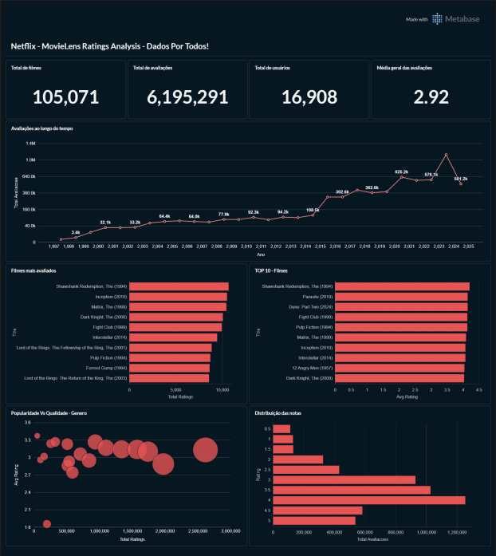

# Netflix MovieLens Ratings Analysis – BigQuery + Metabase - Dados por Todos



Este projeto demonstra a construção de um pequeno pipeline de dados utilizando **Google Cloud Platform (GCP)**, com ingestão, transformação e análise de dados no **BigQuery**, seguido da criação de um **dashboard no Metabase rodando em Docker**.

O objetivo foi simular um cenário de dados de uma plataforma de streaming semelhante à Netflix, utilizando um dataset de avaliações de filmes.

---

## Arquitetura do projeto

Fluxo de dados:

Dataset → BigQuery (RAW) → Transformações SQL → Camada Analítica → Views → Metabase Dashboard

---

## Tecnologias utilizadas

- Google Cloud Platform (GCP)
- BigQuery
- SQL
- Docker
- Metabase
- GitHub

---

## Pipeline de dados

### 1. Ingestão de dados

Os dados foram carregados no BigQuery na camada **RAW**.

Principais tabelas:

- raw_belief_data
- raw_movie_elicitation_set
- raw_movies
- raw_ratings_for_additional_users
- raw_user_rating_history
- raw_user_recommendation_history

---

### 2. Transformação e modelagem

Foi criada uma camada analítica no BigQuery com modelagem dimensional.

#### Tabela dimensão

**dim_movies**

Informações sobre os filmes.

Campos principais:

- movie_id
- title
- genres
- release_year

---

#### Tabela fato

**fact_ratings**

Contém todas as avaliações feitas pelos usuários.

Campos principais:

- user_id
- movie_id
- rating
- rating_ts

---

### 3. Views analíticas

Para facilitar a análise foram criadas diversas views:

- vw_movies_kpis
- vw_user_activity
- vw_top_movies
- vw_genre_performance
- vw_ratings_heatmap
- vw_scatter_popularity_vs_quality

Essas views são utilizadas diretamente no dashboard.

---

## Dashboard

O dashboard foi construído no **Metabase** conectado ao BigQuery.

Principais análises:

- KPIs gerais (total de filmes, avaliações, usuários e média das avaliações)
- evolução das avaliações ao longo do tempo
- filmes mais avaliados
- top filmes mais bem avaliados
- distribuição das avaliações
- análise de gêneros

---

---

## Visualização de Dados

Para a visualização dos dados foi utilizado o **Metabase**, executado localmente utilizando **Docker**.

O Metabase foi conectado ao **BigQuery** para criação do dashboard analítico.

Exemplo de execução do Metabase utilizando Docker:

docker run -d -p 3000:3000 --name metabase metabase/metabase

Após iniciar o container, o Metabase pode ser acessado em:

http://localhost:3000

---

## Observação

Este projeto foi desenvolvido para fins de estudo durante o desafio proposto pela comunidade **Dados por Todos**, com base no conteúdo apresentado por **Luiza**, Youtube: **vbluuiza**.

O objetivo principal foi praticar:

- ingestão de dados no BigQuery
- modelagem analítica
- criação de views para análise
- integração entre BigQuery e ferramentas de BI
- construção de dashboards analíticos

---

## Autor

Pedro Loiola

Projeto desenvolvido para prática de **Data Engineering e Data Analytics utilizando BigQuery, SQL e Metabase**.


```bash
docker run -d -p 3000:3000 --name metabase metabase/metabase
